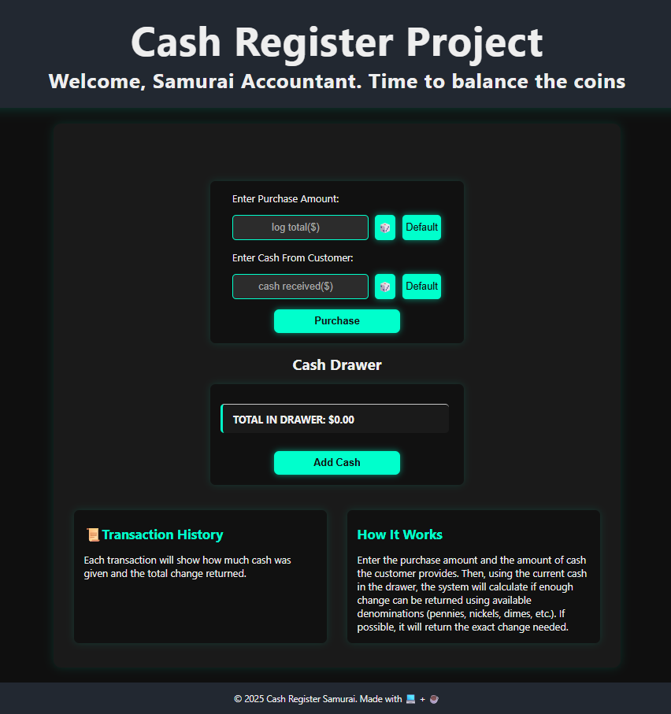
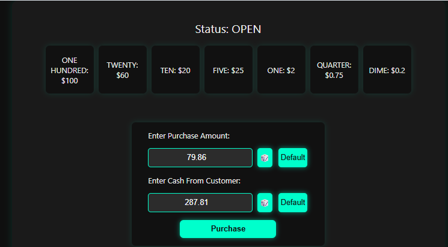
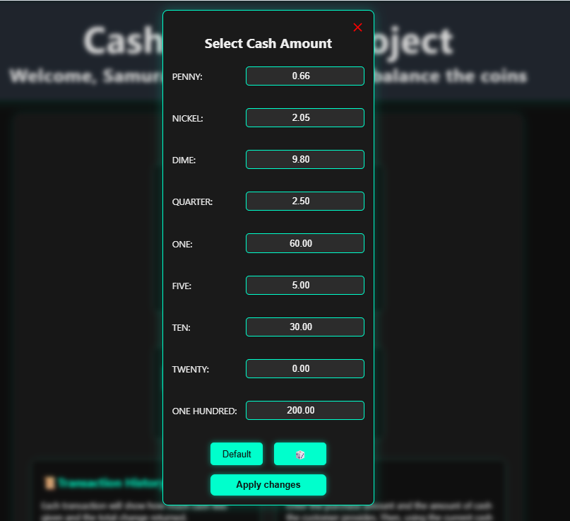
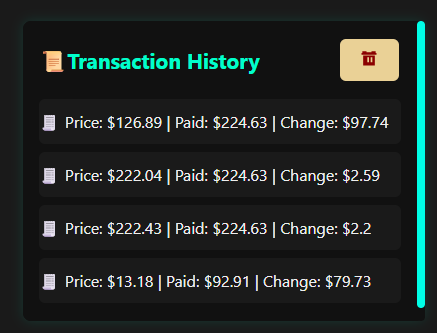

# 💴 Cash Register Project

Welcome, honorable visitor.  
This is the **Cash Register Project**, built with HTML, CSS, and JavaScript. It simulates a real-world register where the cashier (that's you, brave samurai) enters the purchase amount and the cash received, and the system calculates the proper change using available denominations in the drawer.

## ⚔️ Features

- Input fields for **purchase amount** and **cash received**
- 🎲 **Random value** generators for testing
- Set your **own cash drawer** (custom denominations)
- Auto-calculate **change owed**
- Transaction **history log**
- Elegant and clear **UI layout**
- 📜 Scrollable transaction record
- Modal dialog for adjusting cash in drawer
- Accessible interface with keyboard navigation support

## 🛠️ Tech Stack

- **HTML5**
- **CSS3**
- **JavaScript (Vanilla)**

## 🖼️ Screenshots

### 🪙 Home Screen

### 🔢 Performing a Transaction

### 💼 Setting Custom Cash Drawer

### 📜 Viewing Transaction History

## 🧙 Author

> 🥷 HailNail
> _"Coding with unwavering focus and relentless spirit."_
