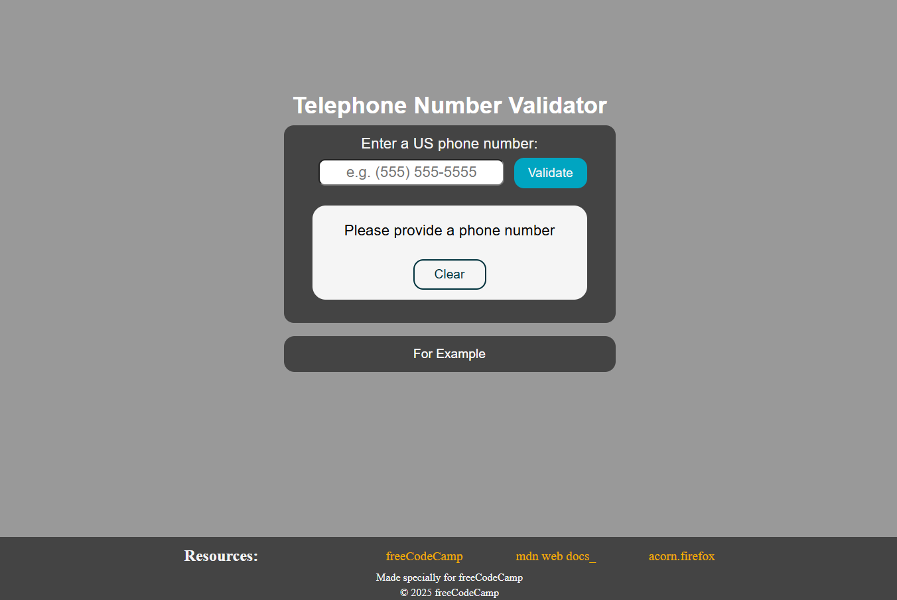
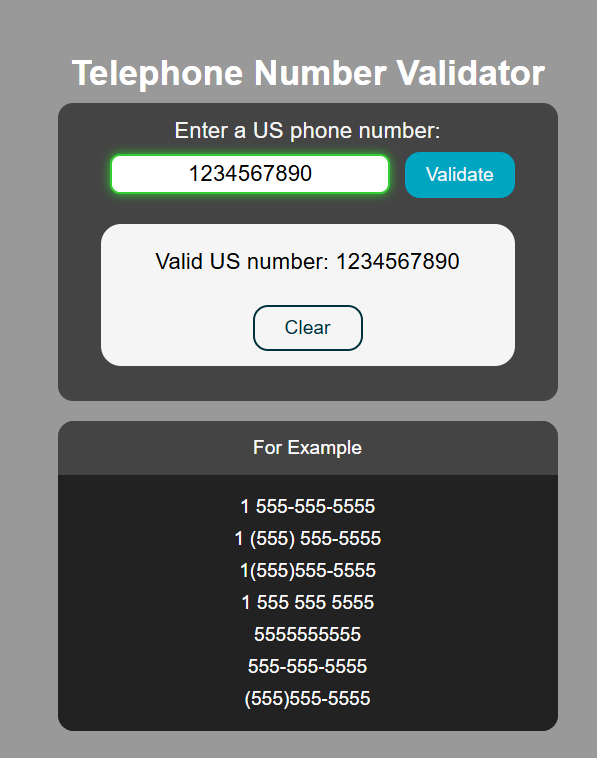
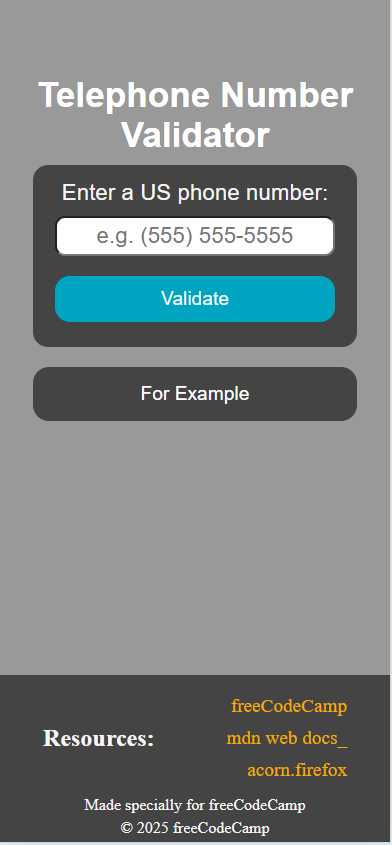

# 📞 Telephone Number Validator

## 🚀 About the project

Validate US phone numbers with lightning speed!  
Handles various formats: parentheses, dashes, spaces, and country code.

✅ Real-time feedback  
✅ Clear, stylish UI  
✅ Built with clean and simple code

---

## 📸 Screenshots

---

## 🛠️ Tech Stack

- **HTML5**
- **CSS3**
- **JavaScript (Vanilla)**

---

## ⚙️ How to use

1. Enter a US phone number into the input field.
2. Click **Check**.
3. Instantly see if the number is valid or not.
4. Use the **Clear** button to reset and try again!

---

## 📚 Learning points

- Regular expressions (Regex) 🧠
- DOM manipulation 🎯
- Event handling in JavaScript ⚡
- Dynamic UI updates ✨

---

## 🧙 Author

> 🥷 HailNail
> _"Coding with unwavering focus and relentless spirit."_

---

## 📜 License

This project is open source and available under the [MIT License](LICENSE).

---
